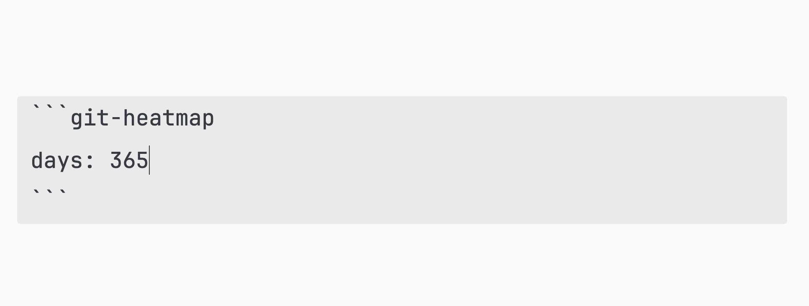
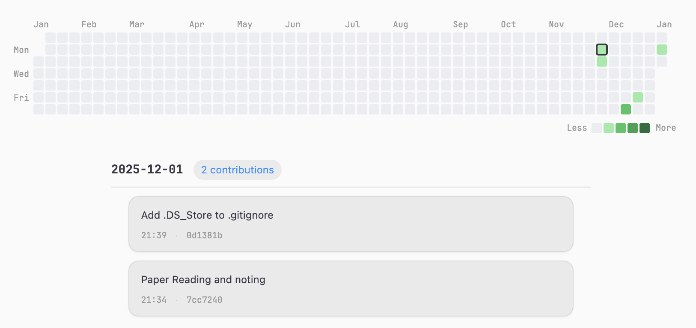

# Git Heatmap Plugin

A plugin for [Obsidian](https://obsidian.md) that provides a GitHub-style contribution heatmap visualization of your **local Git commits** inside your vault. Track your commit habits and vault change frequency over time with an intuitive visual representation!


---

## How it works

This plugin reads commit history from the Git repository that your vault is located in. It runs local `git log` commands to:

- Count how many commits happened each day (used to generate the heatmap)
- Query commit details for a selected date (commit message, time, hash)

The heatmap is rendered inside a Markdown code block (`git-heatmap`) and updates each time the note is rendered.  
All commands are executed **locally**, and no data is uploaded.

> Note: This plugin requires Git to be installed and is **desktop-only** (Obsidian Desktop).  

---

## Usage

### Showing the Heatmap

Add the following code block to any note:



- `days` is optional, default is `365`
- The heatmap will render automatically when the note git is opened

### Interacting with the Heatmap

In the heatmap view, you can:

- Click any day cell to highlight it and view commit details below
- Hover over cells to see a tooltip with the date and commit count
- Use keyboard arrow keys `↑ ↓ ← →` to move the selection and update details instantly  
  (This includes 0-commit days as well)

---

## Installation

### Community Plugin (coming soon)

This plugin can be published to the Obsidian community plugin list in the future.

### Manual Installation

1. Download the files from the latest Release:
   - `main.js`
   - `manifest.json`
   - `styles.css`
2. Place them under:

```
Vault/.obsidian/plugins/git-heatmap/
```

3. Open Obsidian → Settings → Community plugins
4. Enable **Git Heatmap Plugin**

---

## Requirements

- Obsidian Desktop (Windows / macOS / Linux)
- Vault must be a Git repository
- `git` must be available in your system PATH

> Mobile (iOS/Android) is not supported because it cannot execute local Git commands.

---

## Contributing

If you have any ideas for improving the plugin, please open an issue or submit a pull request.  
Some ideas I'd love to add:

- More color themes and palette customization
- Support for author filtering (e.g., only show commits by you)
- Optional display for commit authors / branches
- Performance optimization for very large repos


